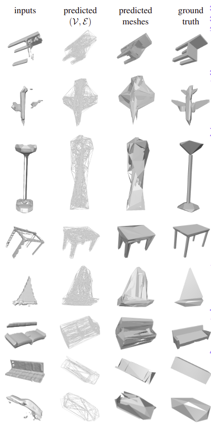

# Scan2Mesh

This is the project repository of my team in the "Machine Learning for 3D Geometry" course at TUM.
A non-official PyTorch implementation for **Scan2Mesh: From Unstructured Range Scans to 3D Meshes** paper on ShapeNet dataset. 


## Installation

```
pip install -r requirements.txt
```

Install PyTorch3D from: https://github.com/facebookresearch/pytorch3d/blob/main/INSTALL.md


## Usage

- Download ShapeNet dataset and store it in **data** folder
- Reduce the meshes in ShapeNet to at most 100 vertices using the notebook **data/Generation Notebook.ipynb**
- Train the vertix prediction model using the following command: 
  ```
  python train_vertix.py --config=configs/vertix_train.json
  ```
- Train the edge prediction model using the following command: 
  ```
  python train_edge.py --config=configs/edge_train.json
  ```
- Train the face prediction model using the following command: 
  ```
  python train_face.py --config=configs/face_train.json
  ```
- Use the visualization notebook **Visualize Results.ipynb** to visualize the trained model on ShapeNet meshes.

## System Results





